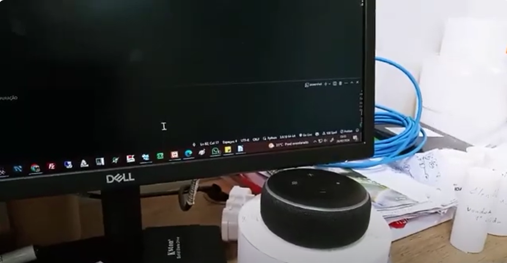

## Sobre o projeto Monitoramento da climatização de um DataCenter com Python e Alexa

A integração entre Python e a Alexa pode ser muito útil para monitoramento na área de Tecnologia da Informação (TI). Onde você pode explorar e usar Python para criar habilidades personalizadas para a assistente virtual Alexa com foco em monitoramento de TI. A Alexa pode ser uma aliada poderosa para monitorar climatização, sistemas, servidores, redes e outros componentes de TI.

<iframe width="560" height="315" src="https://www.youtube.com/embed/V7axe8ULVFU?si=R98Z43WKGvGv9E7Q&amp;start=95" title="YouTube video player" frameborder="0" allow="accelerometer; autoplay; clipboard-write; encrypted-media; gyroscope; picture-in-picture; web-share" allowfullscreen></iframe>

## :rocket: Tecnologias utilizadas / technologies used:
- Python
  - speech_recognition
  - gTTS
  - playsound
  - pyttsx3

## :star: Desenvolvimento:
- [Bruno Martins dos Santos](https://github.com/bnomartins).
